# Mermaid Diagram Skill

## Goal

Create Mermaid diagrams that are:

1. **Accurate to the source**: every node, edge, protocol, direction, state, and boundary must be supported by the provided source or explicitly marked as inferred/unknown.
2. **Simple**: show the smallest diagram that answers the viewer's question. Split complex systems into multiple focused diagrams instead of making one huge diagram.
3. **Readable**: minimize edge crossings, long arrows, ambiguous labels, dense clusters, and overloaded colors.
4. **Modern-looking**: dark theme, restrained palette, consistent shapes, clear grouping, short labels, subtle emphasis.
5. **Native Markdown friendly**: output fenced Mermaid code blocks unless the user asks for HTML/SVG/PNG.

This skill optimizes for diagrams-as-code, not for arbitrary pixel-perfect art. Mermaid layout is automatic, so the main control levers are diagram type, decomposition, node order, edge direction, spacing, edge style, and grouping.

---

## Non-negotiable rules

### Accuracy rules

- **No source, no edge.** Do not invent calls, queues, databases, protocols, ownership, retries, ordering, or failure behavior.
- **Prefer omission over hallucination.** If a relationship is unclear, omit it or mark it with `?` in the label only when the user needs the uncertainty visible.
- **Never collapse two different concepts into one node** unless the source says they are the same runtime/component.
- **Do not turn logical dependencies into runtime calls.** “Uses library X” is not the same as “service calls X”.
- **Direction must match initiator -> dependency / producer -> topic -> consumer / state A -> state B.** Avoid bidirectional arrows unless the source explicitly says both sides initiate distinct flows.
- **Use dashed/dotted edges for inferred, optional, async, or non-primary paths only when the legend defines it.**
- **Keep a private source map while drafting:** each node and edge should map to a source fact, file, paragraph, log line, or user statement.

### Simplicity rules

- Do not make a “complete system diagram” unless the system is small. For complicated systems, produce a **diagram set**.
- Start with one question: “What should the viewer understand after 10 seconds?”
- Prefer **one primary story per diagram**: request path, event flow, deployment topology, data model, state machine, or failure path.
- Max recommended size for one Mermaid flowchart:
  - 8–14 nodes: ideal
  - 15–25 nodes: acceptable with clear clusters
  - 25+ nodes: split unless the user explicitly wants a large map
- Edge labels should be short, usually 1–4 words. Put details outside the diagram.

### Readability rules

- Prefer `flowchart LR` for systems, pipelines, requests, and event flows.
- Prefer `flowchart TB` for lifecycle, decision trees, startup/shutdown, and top-down processes.
- Put sources/clients on the left, sinks/results on the right.
- Put control plane / orchestration above the main path.
- Put storage below the services that own it.
- Put external systems at the outer edges.
- Put queues/topics between producers and consumers.
- Use subgraphs for real boundaries: team, service, VPC, region, process, bounded context, trust boundary.
- Avoid more than 2 nested subgraph levels.
- Avoid crossing arrows by reordering declarations, splitting hubs, introducing topic/API/gateway nodes, or splitting the diagram.
- Avoid long arrows across multiple boxes; route through the correct boundary, gateway, event bus, or an explicit bridge node.

### Modern visual rules

- Use a restrained dark palette. Most nodes should be dark/slate; use bright colors only for semantic categories or the critical path.
- Use shape + color + label, not color alone.
- Use consistent classes: `client`, `service`, `worker`, `queue`, `db`, `external`, `control`, `decision`, `risk`, `success`.
- Prefer rounded rectangles for services, cylinders for databases, rhombi for decisions, stadium/circle for start/end only when helpful.
- Do not overuse icons. Many Markdown Mermaid renderers lack registered icon packs.
- Use thick/high-contrast edge only for the critical path. Everything else should be quiet.

---

## Recommended workflow

### 1. Define scope before drawing

Answer these before writing Mermaid:

- Audience: engineer, product, leadership, on-call, customer, interviewer?
- Purpose: explain, debug, review design, document deployment, compare options, teach concept?
- View type: structure, runtime sequence, data model, state lifecycle, deployment, failure mode?
- Abstraction level: system context, container/service, component, code-level, incident timeline?
- Source confidence: complete, partial, outdated, contradictory?

If the scope is unclear and mistakes would matter, ask a clarifying question before drawing.

### 2. Extract a source-grounded fact model

Before Mermaid, build a small internal model:

```text
Nodes:
- id: short_stable_id
  label: human label
  type: client|service|worker|queue|db|external|control|decision|state
  boundary: cluster/subgraph
  source: where this came from

Edges:
- from: id
  to: id
  label: short action/protocol/event
  kind: sync|async|data|control|unknown|inferred
  source: where this came from

Uncertainties:
- what is missing/ambiguous/conflicting
```

Only after this should Mermaid be written.

### 3. Choose the smallest diagram type

Use this decision table:

| Need | Preferred Mermaid type | Notes |
|---|---|---|
| System/service structure | `flowchart` | Best default. Use subgraphs, classes, edge styles. |
| Cloud/CI/CD services with icons/groups | `architecture-beta` | Good in Mermaid v11.1+, but less portable; provide `flowchart` fallback if renderer is unknown. |
| Time-ordered request flow | `sequenceDiagram` | Best for exact call order, retries, branches, parallel work. |
| Entity lifecycle | `stateDiagram-v2` | Best for valid states, transitions, retries, terminal states. |
| Database/entity relationships | `erDiagram` | Best for schema/cardinality; not runtime flow. |
| Class/package relationships | `classDiagram` | Best for code-level type relationships; avoid for runtime systems. |
| Project schedule | `gantt` | Only for timelines with dates/durations. |
| Incident/history timeline | `timeline` or `sequenceDiagram` | Timeline for human sequence; sequence for service interactions. |
| Git branching/release | `gitGraph` | Only for repo/release flow. |
| High-level taxonomy | `mindmap` | Good for concept grouping, not runtime flow. |
| Volumes/proportional flow | `sankey-beta` | Use only when quantities matter and are known. |
| Requirements traceability | `requirementDiagram` | Useful for specs and compliance links. |
| C4 diagrams | Mermaid `C4*` or `flowchart` | Mermaid C4 is experimental/fixed-style; `flowchart` is often more controllable. |

### 4. Split complex systems into a diagram set

For extremely complicated systems, generate 2–5 focused diagrams:

1. **Context / boundaries**: external actors, major systems, trust boundaries.
2. **Container / service map**: services, queues, databases, ownership boundaries.
3. **Critical runtime path**: sequence diagram for one important request/event.
4. **Failure/retry/state machine**: state diagram or focused flowchart.
5. **Data ownership / schema**: ER or data-flow view.

Do not show every edge in the overview. The overview should be the table of contents, not the book.

---

## Layout tactics for Mermaid flowcharts

### Direction

- Use `flowchart LR` for most system diagrams.
- Use `flowchart TB` when decisions and lifecycles matter more than architecture.
- Avoid `RL`/`BT` unless there is a strong reason.

### Node order matters

Mermaid’s auto-layout is heavily influenced by declaration order. Declare the main path first, left-to-right or top-to-bottom:

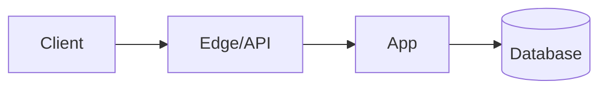

Then add secondary paths, error paths, and observability edges after the main path.

### Use a main spine

For a system overview, first create the main horizontal spine:

```text
User -> Edge -> API -> Core Service -> Result/DB/Event
```

Then attach side systems above/below the closest owner, not as long cross-diagram arrows.

### Reduce edge crossings

Use these in order:

1. **Remove non-essential edges.** If it does not answer the diagram’s question, omit it.
2. **Split the diagram.** Runtime sequence and structural topology rarely belong in the same diagram.
3. **Introduce an aggregator node.** Replace all-to-all edges with `API Gateway`, `Event Bus`, `Shared Library`, `Policy Engine`, etc., only if such a thing exists in the source.
4. **Route through real boundaries.** Use gateway, queue, topic, controller, router, or orchestrator nodes.
5. **Move external systems to the far right/left.**
6. **Use dotted secondary edges** so they visually recede.
7. **Use longer edges intentionally** with extra dashes only when spacing helps: `A ----> B`.
8. **Use invisible edges sparingly** to nudge layout: `A ~~~ B`. Add a comment explaining the layout nudge.

### Avoid long arrows across groups

Bad:

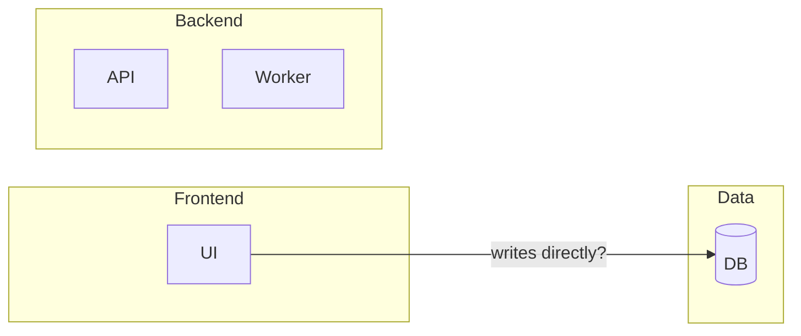

Better, if source says UI calls API and API writes DB:

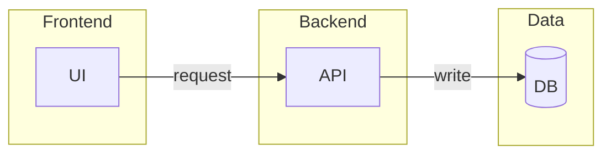

### Subgraph rules

- Use subgraphs only for meaningful boundaries.
- Name subgraphs with nouns: `Client`, `Edge`, `Control Plane`, `Data Plane`, `Storage`, `External Systems`.
- Keep nodes inside a subgraph at the same abstraction level.
- Do not put a PaaS/managed service inside a network boundary unless the source says it runs inside that boundary.
- If a subgraph has external links, Mermaid may ignore internal `direction`; do not rely on subgraph direction for critical layout.

### Link semantics

Use a legend if using more than one edge style.

Recommended defaults:

```text
A --> B        sync request / direct dependency
A -.-> B       async event, optional path, inferred path, or callback
A ==> B        critical/hot path
A --- B        association/no direction only when direction is truly irrelevant
A --x B        rejection, cancellation, blocked path, or denied dependency
```

Avoid bidirectional arrows in flowcharts unless you are explicitly modeling bidirectional communication and the label says why.

---

## Mermaid feature options to use deliberately

### Stable, broadly useful features

Use these by default:

- `flowchart LR/TB`
- subgraphs
- basic shapes: rectangle, rounded rectangle, decision diamond, database cylinder
- edge labels
- `classDef` and `class`
- `linkStyle` only when necessary
- `accTitle` and `accDescr` for accessibility
- comments with `%%`

### Advanced but useful features

Use when the renderer is modern enough:

- `%%{init: {...}}%%` config for theme and flowchart layout
- `flowchart.curve: linear` or `stepBefore` for straighter edges
- `nodeSpacing`, `rankSpacing`, `diagramPadding`, `wrappingWidth`
- `layout: elk` for large/intricate flowcharts when available
- edge IDs and edge-level curve/animation
- new v11.3+ shape syntax: `A@{ shape: rect }`
- `architecture-beta` for cloud/resource diagrams
- sequence diagram participant stereotypes such as database/queue/entity when supported

### Avoid by default for native Markdown portability

- Mermaid icon shape unless icon packs are registered in the renderer.
- Image nodes unless the target renderer allows remote images.
- Click callbacks/JavaScript links unless rendering in a trusted HTML page with `securityLevel: loose`.
- Heavy custom CSS. Native Markdown platforms often strip or isolate CSS.
- Animations unless the user explicitly asks and the target renderer supports them.

---

## Dark theme template for flowcharts

Use this as the default for modern diagrams. If the target platform rejects config directives, remove the `%%{init...}%%` line and keep the `classDef`s.

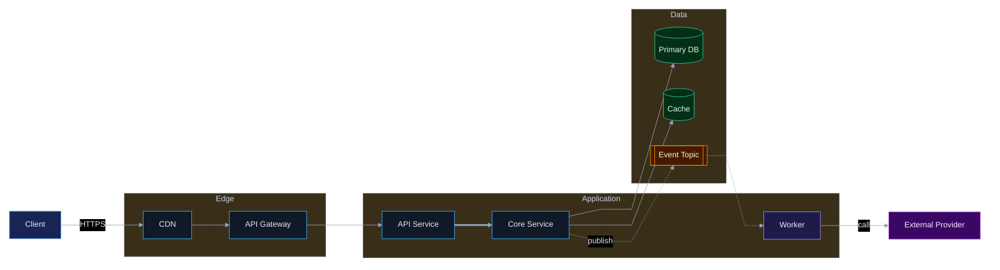

---

## Shape semantics

Use the simplest recognizable shape first. Prefer compatibility over fancy shapes.

| Meaning | Mermaid shape | Example |
|---|---|---|
| Service/process | rectangle or rounded | `api[API]`, `api(API)` |
| Human/user/client | rectangle or actor in sequence | `user[User]` |
| Database/storage | cylinder | `db[(Postgres)]` |
| Queue/topic/stream | subroutine or double bracket | `q[[Kafka topic]]` |
| Decision | diamond | `ok{Valid?}` |
| External system | rectangle with external class | `stripe[Stripe]` |
| Boundary/group | subgraph | `subgraph vpc[VPC] ... end` |
| State | `stateDiagram-v2` state | `Pending --> Running` |
| API/gateway/router | rectangle | `gw[API Gateway]` |
| Job/worker | rectangle with worker class | `worker[Worker]` |
| Manual step/document | use v11.3+ shapes only if supported | `doc@{ shape: doc }` |

Do not use exotic shapes unless their meaning is clear to the viewer or included in a legend.

---

## Diagram-specific recipes

### Recipe A: system overview flowchart

Use when explaining what exists and who talks to whom.

Rules:

- One abstraction level.
- One primary path.
- No implementation details inside nodes.
- Use subgraphs for boundaries.
- Put databases under owning services.
- Put queues between producer and consumer.

Skeleton:

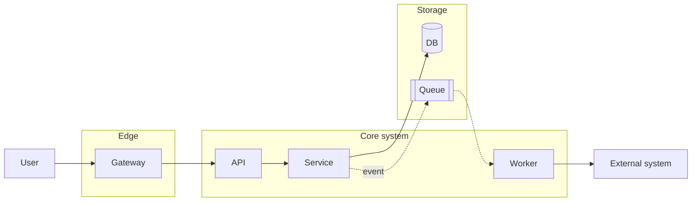

### Recipe B: exact runtime request sequence

Use when order matters.

Rules:

- Max 5–8 participants.
- Declare participants in visual order.
- Use `->>` for sync calls, `-->>` for responses, `-)` or dotted arrows for async when appropriate.
- Use `alt`, `opt`, `loop`, `par`, `critical`, and `break` for branches only when source supports them.
- Do not show every function call. Show component/service interactions.

Skeleton:

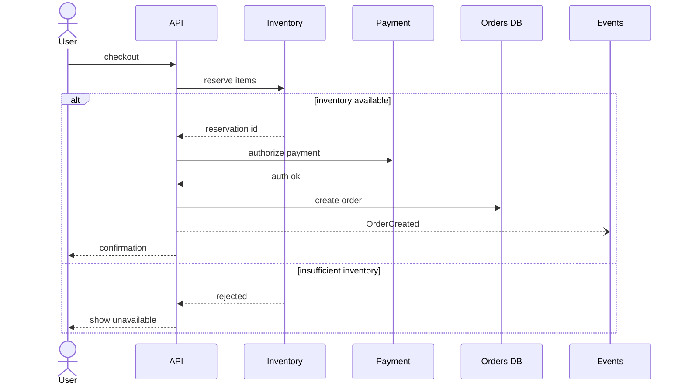

### Recipe C: event-driven flow

Use when async messaging is the important structure.

Rules:

- Show producer -> topic/queue -> consumer.
- Edge label should be event name, not implementation detail.
- Show retry/DLQ only if source says it exists.
- Keep sync calls separate from event flow unless necessary.

Skeleton:

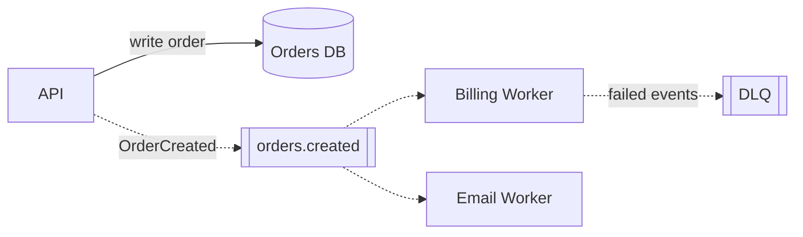

### Recipe D: lifecycle/state machine

Use when correctness depends on allowed transitions.

Rules:

- Include start and terminal states.
- Label transitions with event/condition.
- Invalid transitions should be omitted or shown as rejected only if needed.
- Keep state names short and stable.

Skeleton:

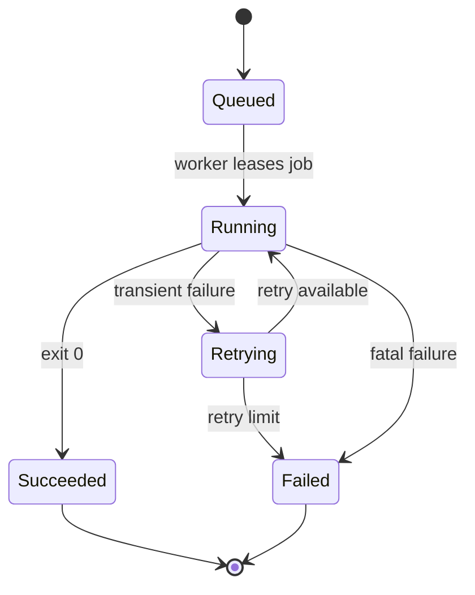

### Recipe E: data model / ownership

Use ER for schema, not service calls.

Skeleton:

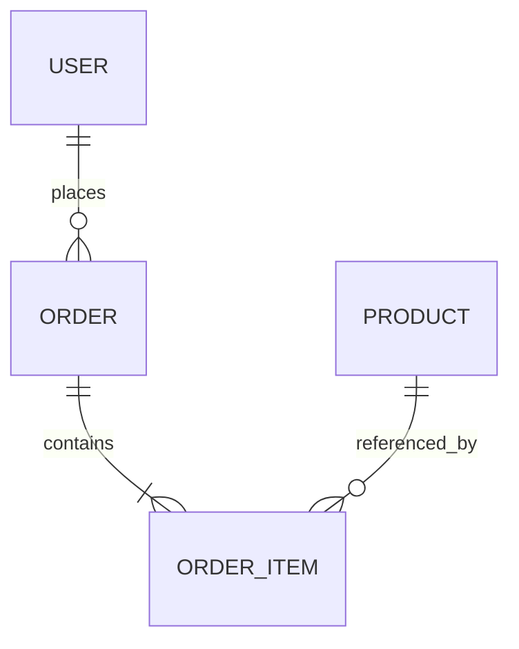

### Recipe F: architecture-beta with fallback

Use `architecture-beta` only when the renderer is known to support Mermaid v11.1+ and the diagram is specifically about services/resources/groups.

Portable fallback is usually a styled `flowchart`.

---

## Compatibility levels

### Tier 1: safest native Markdown

Use for GitHub, GitLab, Obsidian, ChatGPT, docs tools, or unknown renderers:

- `flowchart`, `sequenceDiagram`, `stateDiagram-v2`, `erDiagram`
- basic shapes
- subgraphs
- `classDef`
- edge labels
- `accTitle`, `accDescr`

### Tier 2: modern Mermaid renderers

Use when Mermaid v11+ is available:

- theme config with `%%{init: ...}%%`
- layout config: `curve`, `nodeSpacing`, `rankSpacing`, `wrappingWidth`
- edge IDs
- v11.3+ expanded shapes
- sequence participant stereotypes

### Tier 3: controlled renderer / custom HTML

Use only when rendering environment is controlled:

- ELK layout
- architecture diagrams
- icon/image nodes
- click callbacks
- custom CSS
- animations

When unsure, output Tier 1 first and add “modern renderer version” as an optional alternative.

---

## Styling system

### Recommended classes

Use this class set as a base. Do not use every class unless needed.

```mermaid
flowchart LR
  classDef client fill:#172554,stroke:#60A5FA,color:#DBEAFE,stroke-width:1px
  classDef service fill:#111827,stroke:#38BDF8,color:#E5E7EB,stroke-width:1px
  classDef worker fill:#1E1B4B,stroke:#A78BFA,color:#EDE9FE,stroke-width:1px
  classDef queue fill:#451A03,stroke:#F59E0B,color:#FEF3C7,stroke-width:1px
  classDef db fill:#052E16,stroke:#34D399,color:#D1FAE5,stroke-width:1px
  classDef external fill:#3B0764,stroke:#E879F9,color:#FAE8FF,stroke-width:1px
  classDef control fill:#312E81,stroke:#818CF8,color:#E0E7FF,stroke-width:1px
  classDef decision fill:#422006,stroke:#FACC15,color:#FEF9C3,stroke-width:1px
  classDef risk fill:#450A0A,stroke:#F87171,color:#FEE2E2,stroke-width:1px
  classDef success fill:#052E16,stroke:#22C55E,color:#DCFCE7,stroke-width:1px
```

### Palette discipline

- Blue: clients/edge/API.
- Cyan: normal services.
- Purple: workers/control plane.
- Green: durable data/success.
- Amber: queues/async/decision.
- Red: risk/failure only.
- Magenta: external/vendor/unknown boundary.

Never use more than 6 semantic colors in one diagram.

### Typography

- Prefer short labels: `API`, `Worker`, `Orders DB`.
- Add technology only when it matters: `API\nGo`, `Queue\nPub/Sub`.
- Avoid paragraphs inside nodes.
- If using Markdown strings, keep them simple:

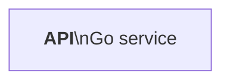

---

## Accuracy verification checklist

Before final output, check:

### Source fidelity

- Every node exists in the source.
- Every edge exists in the source or is explicitly marked as inferred.
- Edge direction matches initiator/producer/state transition.
- Edge label uses the real protocol/event/action when known.
- Storage ownership and network boundaries are not invented.
- No stale docs overrode current code/logs/config.
- Ambiguous facts are omitted or listed as assumptions.

### Diagram quality

- The title/purpose is clear.
- The main story is visible in 10 seconds.
- No overloaded all-to-all hairball.
- No unnecessary nodes.
- No unnecessary edge labels.
- No edge style without legend/meaning.
- No giant subgraph nesting.
- Critical path is visually distinct only if that helps.
- The diagram can survive being viewed at typical documentation width.

### Mermaid syntax

- Fenced block starts with ```mermaid.
- Diagram type appears after optional init/frontmatter.
- Node IDs are simple ASCII identifiers: `api`, `orders_db`, `worker1`.
- Labels with special characters are quoted.
- Avoid using bare `end` as a node label; quote it.
- Comments use `%%` on their own lines.
- `class` statements refer to existing node IDs.
- If using edge IDs, use valid modern syntax and provide fallback if renderer may be old.

---

## Render validation when tools are available

If a Mermaid parser/renderer is available, validate before finalizing.

Preferred local checks:

```bash
# Render one Mermaid file to SVG
mmdc -i diagram.mmd -o diagram.svg

# Dark transparent PNG
mmdc -i diagram.mmd -o diagram.png -t dark -b transparent
```

For Markdown files with embedded diagrams:

```bash
mmdc -i README.template.md -o README.md
```

If validation is not available, perform a manual syntax review with the checklist above.

---

## Common anti-patterns and fixes

### Anti-pattern: one mega-diagram

Problem: 40 nodes, 80 arrows, impossible to read.

Fix: split into overview + sequence + state + data ownership.

### Anti-pattern: arrows everywhere

Problem: every service points to every other service.

Fix: show only primary dependencies. Use gateway/topic/controller nodes if they exist. Otherwise split by use case.

### Anti-pattern: misleading bidirectional arrows

Problem: `A <--> B` hides who initiates what.

Fix: use two labeled arrows or a sequence diagram.

### Anti-pattern: mixed abstraction levels

Problem: UI component, Kubernetes node, database table, and S3 bucket are peers.

Fix: choose one abstraction level per diagram or split.

### Anti-pattern: color as decoration

Problem: colors look pretty but encode nothing.

Fix: colors must map to semantic classes.

### Anti-pattern: stale architecture diagram from docs

Problem: source docs say one thing, code/config says another.

Fix: cite uncertainty; prefer runtime/source-of-truth files when making implementation diagrams.

### Anti-pattern: fake simplicity

Problem: hides a real async queue, retry, or trust boundary to make the chart clean.

Fix: simplify layout, not truth. Show the important real boundary/path.

---

## Output contract

When asked to create a diagram:

1. If needed, ask one clarifying question.
2. Otherwise, produce the Mermaid diagram directly.
3. For complex systems, produce a diagram set and label each diagram’s purpose.
4. After the diagram, include a tiny “Notes / assumptions” section only when useful.
5. Do not dump the internal fact table unless the user asks for auditability.

Recommended final format:

````text
Here is the focused service-level overview:

```mermaid
...
```

Notes:
- Dashed arrows are async events.
- I omitted internal helper functions to keep this at service level.
````

---

## Quick prompt for LLMs using this skill

When generating Mermaid, silently follow this loop:

```text
1. Identify source facts.
2. Choose the smallest diagram type.
3. Split if too dense.
4. Lay out the main story first.
5. Add only source-supported edges.
6. Apply restrained dark style/classes.
7. Check syntax and readability.
8. Output native Markdown Mermaid.
```

---

## Mermaid snippets library

### Straight-ish modern flowchart config


### Stepped edges

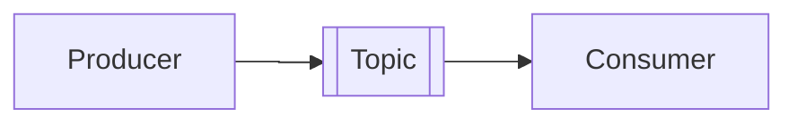

### Edge-length nudge

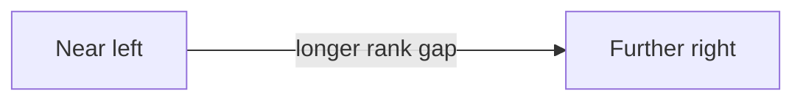

### Invisible layout nudge

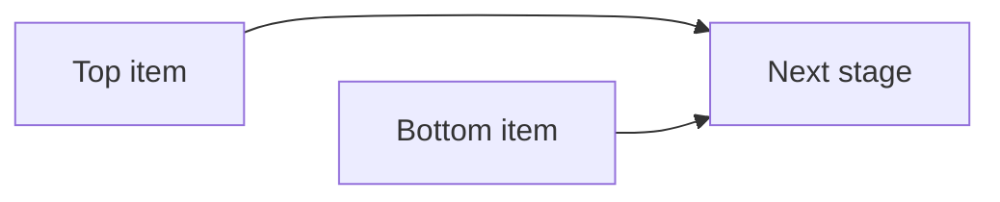

### Legend pattern

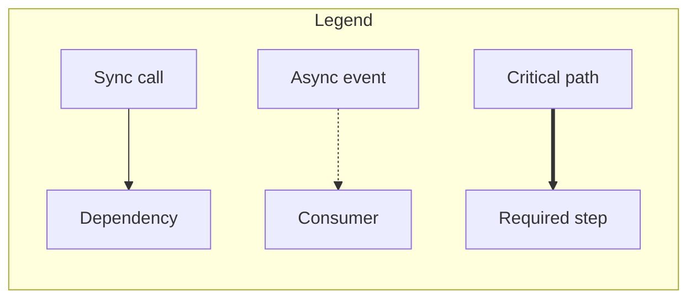

### Minimal state machine

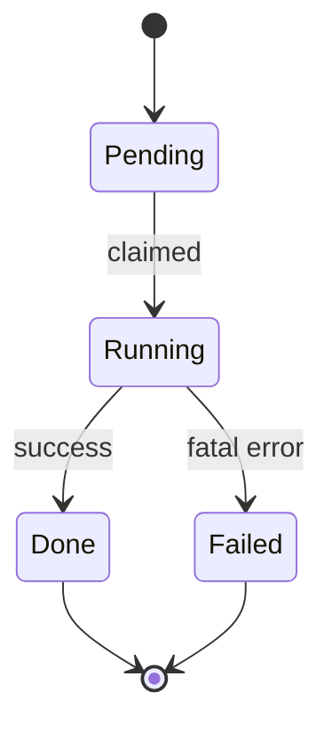

### Minimal sequence branch

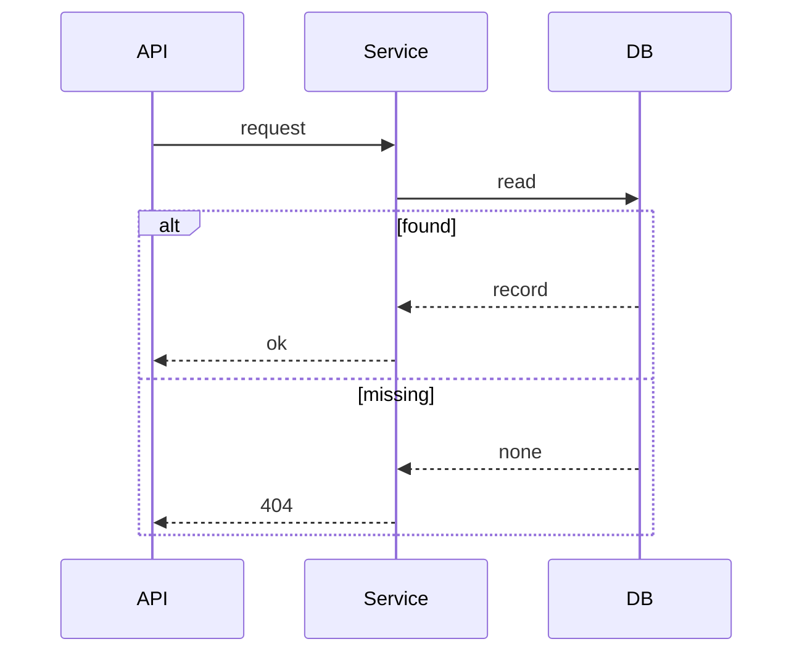
